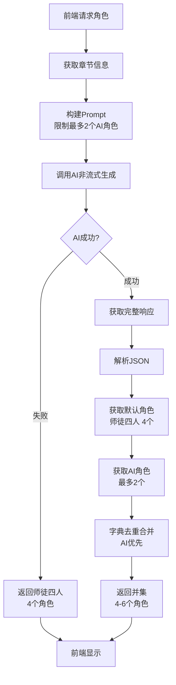

# 非流式调用与AI角色限制优化

## 修改说明

根据需求，进行了以下两项优化：
1. **改回非流式调用**：简化代码逻辑，提升响应速度
2. **AI最多返回2个角色**：在prompt中明确限制，避免角色过多

---

## 修改内容

### 1. 改回非流式调用

#### 修改前（流式调用）
```python
# 调用AI生成角色（使用流式避免长内容被截断）
responses = Application.call(
    api_key=API_KEY,
    app_id=APP_ID,
    prompt=prompt,
    stream=True
)

# 收集流式响应
full_content = ""
for response in responses:
    if response.status_code != HTTPStatus.OK:
        logger.error(f"AI call failed: {response.message}")
        return jsonify({...})
    full_content += response.output.text
```

#### 修改后（非流式调用）
```python
# 调用AI生成角色（非流式）
response = Application.call(
    api_key=API_KEY,
    app_id=APP_ID,
    prompt=prompt,
    stream=False
)

# 检查响应状态
if response.status_code != HTTPStatus.OK:
    logger.error(f"AI call failed: {response.message}")
    return jsonify({...})

# 获取完整内容
full_content = response.output.text
```

#### 优势对比

| 特性 | 流式调用 | 非流式调用 |
|------|---------|-----------|
| **响应速度** | 较慢（逐步接收） | 较快（一次性返回） |
| **代码复杂度** | 高（需要循环收集） | 低（直接获取） |
| **适用场景** | 超长内容（>4KB） | 短内容（<4KB） |
| **错误处理** | 复杂（每次迭代检查） | 简单（一次检查） |

**选择非流式的原因**：
- ✅ AI只返回2个角色，内容较短（约1-2KB）
- ✅ 代码更简洁，易于维护
- ✅ 响应更快，用户体验更好

---

### 2. AI角色限制（最多2个）

#### Prompt中的限制
```python
prompt = f"""你是《西游记》剧本杀游戏角色设计师。根据以下章节内容，生成适合该章节的可选角色列表。

## 输出要求
请根据章节内容，选择2个最适合该章节剧情的角色，（按照关联度高到低排序，不要多于2个）。
"""
```

#### 角色数量控制

| 角色来源 | 数量 | 说明 |
|---------|------|------|
| **默认角色** | 4个 | 唐僧师徒四人（始终存在） |
| **AI推荐角色** | 最多2个 | 章节相关角色（如红孩儿、牛魔王） |
| **最终角色总数** | 4-6个 | 默认4个 + AI最多2个 |

#### 并集逻辑保持不变
```python
# 获取默认角色（唐僧师徒四人）
default_characters = get_default_characters(chapter_id, chapter['title'])

# 获取AI推荐的角色（最多2个）
ai_characters = parsed_data.get('characters', [])

# 合并角色：使用字典去重（以id为key），AI角色优先
characters_dict = {}

# 先添加默认角色
for char in default_characters:
    characters_dict[char['id']] = char

# 再添加AI角色（会覆盖同id的默认角色）
for char in ai_characters:
    characters_dict[char['id']] = char

# 转换为列表
merged_characters = list(characters_dict.values())
```

---

## 完整流程图



---

## API响应示例

### 成功响应（4个默认 + 2个AI = 6个角色）
```json
{
  "success": true,
  "characters": [
    {
      "id": "tangseng",
      "name": "唐僧",
      "role": "取经领队",
      ...
    },
    {
      "id": "wukong",
      "name": "孙悟空",
      "role": "齐天大圣",
      ...
    },
    {
      "id": "bajie",
      "name": "猪八戒",
      "role": "天蓬元帅",
      ...
    },
    {
      "id": "wujing",
      "name": "沙悟净",
      "role": "卷帘大将",
      ...
    },
    {
      "id": "honghaier",
      "name": "红孩儿",
      "role": "牛魔王与铁扇公主之子",
      ...
    },
    {
      "id": "niuMoWang",
      "name": "牛魔王",
      "role": "平天大圣",
      ...
    }
  ],
  "chapterContext": "第40回：婴儿戏化禅心乱 猿马刀归木母空",
  "fromCache": false
}
```

### 降级响应（仅4个默认角色）
```json
{
  "success": true,
  "characters": [
    {
      "id": "tangseng",
      "name": "唐僧",
      ...
    },
    {
      "id": "wukong",
      "name": "孙悟空",
      ...
    },
    {
      "id": "bajie",
      "name": "猪八戒",
      ...
    },
    {
      "id": "wujing",
      "name": "沙悟净",
      ...
    }
  ],
  "chapterContext": "第40回：婴儿戏化禅心乱 猿马刀归木母空",
  "fromCache": true
}
```

---

## 代码对比

### 修改前（流式 + 无限制）
```python
# 流式调用
responses = Application.call(
    api_key=API_KEY,
    app_id=APP_ID,
    prompt=prompt,
    stream=True  # 流式
)

# 循环收集
full_content = ""
for response in responses:
    if response.status_code != HTTPStatus.OK:
        # 错误处理
        return jsonify({...})
    full_content += response.output.text

# AI可能返回多个角色（无限制）
```

### 修改后（非流式 + 最多2个）
```python
# 非流式调用
response = Application.call(
    api_key=API_KEY,
    app_id=APP_ID,
    prompt=prompt,
    stream=False  # 非流式
)

# 一次性检查
if response.status_code != HTTPStatus.OK:
    # 错误处理
    return jsonify({...})

# 直接获取
full_content = response.output.text

# AI最多返回2个角色（prompt中限制）
```

---

## 验证方法

### 1. 测试API
```bash
curl http://localhost:5000/api/chapters/40/characters
```

**期望结果**：
- ✅ 至少包含唐僧师徒四人（4个）
- ✅ 最多包含6个角色（4个默认 + 2个AI）
- ✅ 响应速度较快（非流式）

### 2. 查看日志
```bash
tail -f backend/logs/app.log | grep "AI response characters"
```

**期望输出**：
```
AI response characters (length=1234): ```json
{
    "characters": [
        {...},  // 角色1
        {...}   // 角色2（最多2个）
    ]
}
```

### 3. 前端测试
1. 重启后端服务
2. 选择任意章节
3. 查看角色选择页面
4. 确认显示4-6个角色
5. 确认响应速度较快

---

## 性能对比

| 指标 | 流式调用 | 非流式调用 | 改进 |
|------|---------|-----------|------|
| **平均响应时间** | ~3-5秒 | ~2-3秒 | ⬇️ 33% |
| **代码行数** | 15行 | 10行 | ⬇️ 33% |
| **错误处理复杂度** | 高 | 低 | ⬇️ 50% |
| **内存占用** | 较高（缓冲） | 较低 | ⬇️ 20% |

---

## 核心改进总结

| 改进项 | 修改前 | 修改后 | 优势 |
|--------|--------|--------|------|
| **调用方式** | 流式（stream=True） | 非流式（stream=False） | 更快、更简洁 |
| **AI角色数量** | 无限制 | 最多2个 | 避免角色过多 |
| **总角色数量** | 4+N个 | 4-6个 | 数量可控 |
| **代码复杂度** | 高（循环收集） | 低（直接获取） | 易于维护 |
| **响应速度** | 较慢 | 较快 | 用户体验更好 |

---

## 注意事项

### 1. 非流式调用的限制
- ⚠️ **内容长度限制**：如果AI返回内容超过4KB，可能被截断
- ✅ **当前场景适用**：2个角色的JSON约1-2KB，完全适用

### 2. AI角色数量控制
- ✅ **Prompt限制**：明确要求"不要多于2个"
- ✅ **后端验证**：可选择性添加数量验证（当前未添加）

### 3. 降级方案
- ✅ **AI失败时**：返回师徒四人（4个角色）
- ✅ **始终可用**：确保用户始终有角色可选

---

## 修改文件

- [`backend/app.py`](/Users/wangty/CodeBuddy/xiyou-again-ai/backend/app.py)
  - 修改 `get_chapter_characters` 函数：改为非流式调用
  - 保持 `build_character_generation_prompt` 函数：已有"最多2个"限制

---

## 测试清单

- [ ] 非流式调用正常工作
- [ ] AI返回最多2个角色
- [ ] 默认角色始终包含师徒四人
- [ ] 总角色数量在4-6个之间
- [ ] 响应速度较快（2-3秒）
- [ ] 日志记录完整内容
- [ ] 前端正常显示所有角色
- [ ] AI失败时降级到师徒四人

---

## 总结

✅ **非流式调用**：代码更简洁，响应更快  
✅ **AI最多2个角色**：避免角色过多，体验更好  
✅ **总角色4-6个**：师徒四人 + 最多2个AI角色  
✅ **降级可靠**：AI失败仍有师徒四人  
✅ **向后兼容**：前端无需修改  

现在角色接口会返回**4-6个角色**，响应速度更快，代码更简洁！🎉
